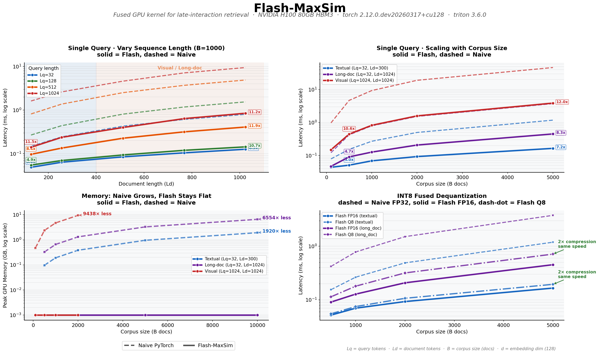

# Flash-MaxSim

Fused Triton GPU kernel for ColBERT/ColPali MaxSim scoring. Up to **13x faster**, **143x less memory**. The similarity matrix never touches HBM.

**Requirements:** NVIDIA GPU (Ampere or newer recommended), CUDA, PyTorch >= 2.0, Triton >= 3.4.

Tested on: H100 80GB, A100, V100.



## Install

```bash
pip install flash-maxsim
```

## Get Started (from source)

```bash
git clone https://github.com/roipony/flash-maxsim.git
cd flash-maxsim
pip install -e ".[dev]"
pytest tests/ -v
python benchmarks/bench.py

# For the notebook (includes pylate, jupyter, matplotlib):
pip install -e ".[dev,notebook]"
jupyter notebook examples/demo_notebook.ipynb
```

## Quick Start

```python
import torch
from flash_maxsim import flash_maxsim, flash_maxsim_batched

# Single query scoring
Q = torch.randn(32, 128, device="cuda", dtype=torch.float16)
D = torch.randn(1000, 300, 128, device="cuda", dtype=torch.float16)
scores = flash_maxsim(Q, D)  # [1000]

# Batched: all queries vs all docs
Q_batch = torch.randn(100, 32, 128, device="cuda", dtype=torch.float16)
scores = flash_maxsim_batched(Q_batch, D, shared_docs=True)  # [100, 1000]

# INT8 quantized (2x compression, same speed)
from flash_maxsim import flash_maxsim_int8, quantize_int8
D_q, scales, mins = quantize_int8(D)
scores = flash_maxsim_int8(Q, D_q, scales, mins)

# Training (autograd)
from flash_maxsim import flash_maxsim_train
Q = torch.nn.Parameter(Q)
scores = flash_maxsim_train(Q, D)
scores.sum().backward()  # gradients to Q and D
```

## Benchmarks (H100 80GB, triton 3.6.0)

### Single Query Speedup (vs naive FP32 einsum, B=1000)

| Config | Naive | Flash | Speedup |
|--------|-------|-------|---------|
| Textual (Lq=32, Ld=300) | 0.27 ms | 0.07 ms | **3.9x** |
| Long-doc (Lq=32, Ld=1024) | 0.80 ms | 0.13 ms | **6.3x** |
| Medium (Lq=128, Ld=1024) | 1.55 ms | 0.14 ms | **10.7x** |
| Visual (Lq=1024, Ld=1024) | 9.47 ms | 0.85 ms | **11.2x** |

### Corpus Scaling (single query)

| Config | B=500 | B=1000 | B=5000 |
|--------|-------|--------|--------|
| Textual (Lq=32, Ld=300) | 3.0x | 3.9x | **7.2x** |
| Long-doc (Lq=32, Ld=1024) | 4.7x | 6.3x | **8.3x** |
| Visual (Lq=1024, Ld=1024) | 10.6x | 11.3x | **12.0x** |

### INT8 Fused Dequantization

| Config | Naive FP32 | Flash FP16 | Flash Q8 |
|--------|-----------|------------|----------|
| Textual B=1000 | 0.27 ms | 0.07 ms | 0.08 ms |
| Textual B=5000 | 1.19 ms | 0.17 ms | 0.20 ms |
| Long-doc B=5000 | 3.77 ms | 0.45 ms | 0.71 ms |

2x storage compression, same ranking quality. Dequantization fused in SRAM.

### Peak Memory

| Config | Naive | Flash | Reduction |
|--------|-------|-------|-----------|
| Textual 1q × 10K docs | 1.92 GB | <0.1 MB | **1920x** |
| Long-doc 1q × 10K docs | 6.55 GB | <0.1 MB | **6554x** |
| Visual 1q × 1K docs | 4.72 GB | <0.1 MB | **4719x** |
| Visual 1q × 2K docs | 9.44 GB | <0.1 MB | **9438x** |

## How It Works

```
Q_block = load(Q)                      # SRAM
m = [-inf] * Lq                        # registers

for tile in D.tiles(BLOCK_D):
    D_tile = load(tile)                # SRAM
    S = tl.dot(Q_block, D_tile.T)     # tensor cores — SRAM only
    m = max(m, S.max(axis=1))         # online max
    # S dies here — never in HBM

score = sum(m)                          # → HBM
```

Same pattern as Flash Attention, but simpler: `max` is trivially composable (no rescaling needed unlike `softmax`).

## Supported Embedding Dimensions

Works with any embedding dimension. Autotune selects optimal block sizes per config:

| Dimension | Models | Status |
|-----------|--------|--------|
| d=128 | ColBERT, ColPali, answerai-colbert-small | Tested |
| d=256 | BGE-M3, multilingual models | Tested |
| d=512 | Large bi-encoders | Tested |
| d=1024 | E5-large, GTE-large | Tested |
| d=2048 | Custom / fine-tuned models | Tested |

## API

| Function | Input → Output | Description |
|----------|---------------|-------------|
| `flash_maxsim` | `[Lq,d] × [B,Ld,d] → [B]` | Single query |
| `flash_maxsim_batched` | `[Nq,Lq,d] × [B,Ld,d] → [Nq,B]` | Multi-query |
| `flash_maxsim_int8` | `[Lq,d] × [B,Ld,d] uint8 → [B]` | Fused INT8 |
| `flash_maxsim_train` | `[Lq,d] × [B,Ld,d] → [B]` | With autograd |
| `quantize_int8` | `[B,Ld,d] → uint8 + scales + mins` | Quantization |
| `maxsim_naive` | `[Lq,d] × [B,Ld,d] → [B]` | Reference |

## Files

```
flash_maxsim/
  flash_maxsim.py        # FP16 + batched + training kernels (290 lines)
  flash_maxsim_quant.py  # INT8 fused kernel (140 lines)
tests/
  test_flash_maxsim.py   # pytest suite
benchmarks/
  bench.py               # full benchmark
examples/
  demo.py                # real model demo
  demo_notebook.ipynb    # interactive notebook with plots
```

## Authors

**IBM Research Israel**

- Roi Pony — [roi.pony@ibm.com](mailto:roi.pony@ibm.com)
- Adi Raz Goldfarb — [adi.raz@ibm.com](mailto:adi.raz@ibm.com)
- Idan Friedman — [idan.friedman@ibm.com](mailto:idan.friedman@ibm.com)
- Udi Barzelay — [udib@il.ibm.com](mailto:udib@il.ibm.com)

## Citation

Coming soon.

## License

Apache 2.0
